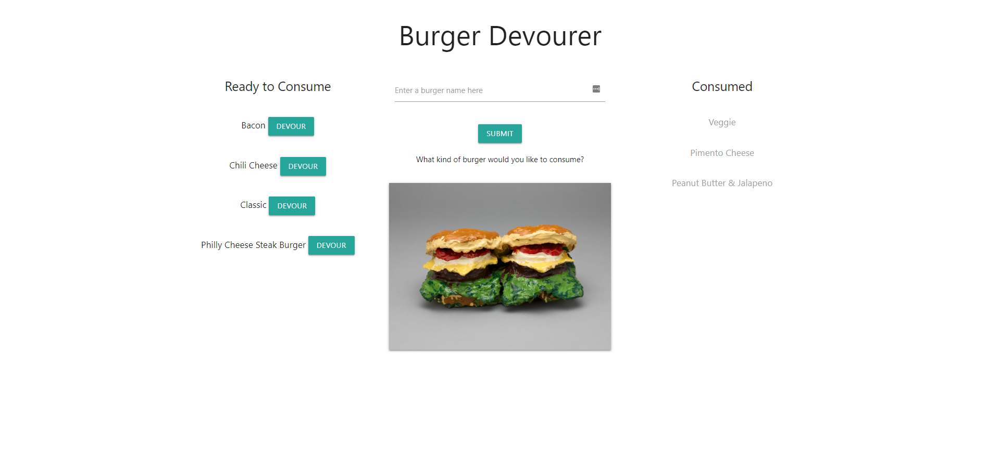

# Burger Devourer
## UNC Coding Bootcamp Handlebars/ORM Homework  12-19-2018

This app allows the user to create different burgers that they would like to consume and add them to a MySQL database. These burgers will be displayed to the user with a "Devour" button. On clicking this button, the burger will be consumed, it's status will be changed to "devoured" in the database, and it will be displayed to the user in a list of "Consumed" burgers. 

The deployed app can be viewed at: https://burger-devourer-app.herokuapp.com/

The main purpose of this app is to demonstrate ability with the following tools and techniques, especially Handlebars and custom ORMs:
  * Handlebars and HTML for web page templates and structure
  * Materialize for CSS framework
  * Node.js for Javascript runtime environment
  * Express.js for server setup and routing
  * Javascript for app logic and interactive elements
  * jQuery for additional Javascript functionality and AJAX calls to server
  * Heroku for app deployment and hosting
  * MVC design pattern for app architecture

Installation: requires express, express-handlebars, and mysql npm packages.

### Screenshots

